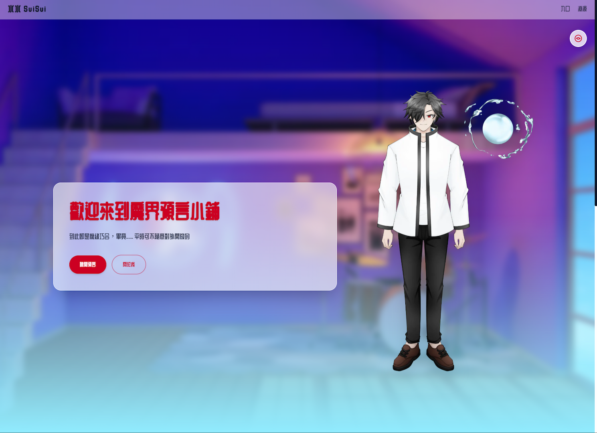

<div align="center">



</div>

# 水水 SuiSui

A modern, high-performance personal website for **水水 (SuiSui)**, a VTuber and content creator. Built with cutting-edge web technologies and optimized for static deployment.

🌐 **Live Site:** https://suisui0528.github.io/

## Project Overview

This is a single-page static site showcasing:

- **Character Introduction**: Profile of 水水, including personality traits, hobbies, and character details
- **Dynamic Backgrounds**: Time-based theme switching (Day/Evening/Night modes that update automatically)
- **Social Media Integration**: Direct links to streaming platforms (Twitch, YouTube, X, Discord, Instagram, Shopee)
- **Artist Credits**: Attribution to the illustrators and Live2D artists behind the character design
- **Accessibility-First Design**: Semantic HTML, keyboard navigation, screen reader support

## Tech Stack

| Category            | Tool                                                                      |
| ------------------- | ------------------------------------------------------------------------- |
| **Framework**       | [Svelte](https://svelte.dev/)                                             |
| **Styling**         | [Tailwind CSS](https://tailwindcss.com/)                                  |
| **Language**        | [TypeScript](https://www.typescriptlang.org/)                             |
| **Build Tool**      | [Vite](https://vitejs.dev/)                                               |
| **Icons**           | [Lucide Svelte](https://lucide.dev/) & [SVG LOGOS](https://svglogos.dev/) |
| **Package Manager** | [pnpm](https://pnpm.io/)                                                  |
| **Linting**         | [ESLint](https://eslint.org/) + [Prettier](https://prettier.io/)          |

### Key Features

- **Static Site Generation**: Pre-rendered HTML/CSS/JS via `@sveltejs/adapter-static`
- **Pre-Compression**: All assets pre-compressed with Brotli (`.br` files) for optimal edge delivery
- **Svelte 5 Runes**: Uses modern reactive API (no legacy `script setup` syntax)
- **Tailwind CSS v4**: Latest Tailwind with `@import 'tailwindcss'` syntax
- **TypeScript Strict Mode**: Enforces strict null checking and type safety
- **Accessibility**: WCAG-compliant with semantic HTML and skip links

## Getting Started

### Prerequisites

- **Node.js**: 24+ (LTS recommended)
- **pnpm**: 10+

### Installation

1. **Clone the repository**

   ```bash
   git clone https://github.com/suisui0528/suisui.github.io
   cd suisui.github.io
   ```

2. **Install dependencies**

   ```bash
   pnpm install
   ```

3. **Start development server**
   ```bash
   pnpm dev
   ```

## Available Scripts

| Command            | Purpose                               |
| ------------------ | ------------------------------------- |
| `pnpm dev`         | Start Vite dev server with hot reload |
| `pnpm build`       | Generate production build             |
| `pnpm preview`     | Preview production build locally      |
| `pnpm check`       | Run TypeScript & Svelte validation    |
| `pnpm check:watch` | Watch mode for type checking          |
| `pnpm lint`        | Check code formatting & ESLint rules  |
| `pnpm format`      | Auto-format code with Prettier        |

## Main Features

### 1. Dynamic Time-Based Backgrounds

The **Hero** component automatically switches backgrounds based on time of day:

- **Day Mode**: Bright, daytime background image
- **Evening Mode**: Sunset/golden hour background image
- **Night Mode**: Dark, nighttime background image

Users can manually override the automatic theme using the theme toggle button. The app updates the background every minute.

### 2. Responsive Navigation

- Fixed header with site branding
- Smooth scroll links to page sections
- Backdrop blur & dynamic shadow on scroll
- Mobile-friendly design

### 3. Character Profile

Central character information page includes:

- Character description & details
- Personality traits & hobbies
- Original artist & Live2D artist credits

### 4. Social Media Links

Direct links to all major platforms:

- Twitch
- YouTube
- X (Twitter)
- Discord
- Instagram
- Shopee

### 5. SEO & Open Graph

Optimized with:

- Semantic HTML (schema.org structured data)
- Open Graph metadata for social sharing
- Canonical URLs
- Mobile viewport & favicon

## Build & Deployment

### Local Build

```bash
pnpm build
```

This generates a static site in the `build/` directory with:

- Pre-rendered HTML pages
- Minified CSS/JavaScript
- Pre-compressed Brotli assets (`.br` files)

### Preview Production Build

```bash
pnpm preview
```

Serves the production build locally to test before deployment.

### Deploy to GitHub Pages

The project uses **GitHub Pages** with pre-compressed content.
The site is configured with:

- Base path: `` (root of domain)
- 404 fallback: `404.html`
- Precompression: Brotli (`.br` files)

## Code Standards

### ESLint Configuration

Uses ESLint with the flat config system:

- Svelte plugin for `.svelte` file linting
- TypeScript ESLint for `.ts` files
- Files checked: `src/`, `vite.config.ts`, `svelte.config.js`, `eslint.config.js`

### Prettier Configuration

Automatic code formatting with:

- 1 tab indentation
- Svelte parser integration
- Tailwind class sorting plugin
- Line width: 100 characters

## Performance Optimizations

- **Brotli Compression**: All assets pre-compressed (`.br` files)
- **Static Generation**: No server-side rendering overhead
- **WebP Images**: Modern image format for reduced file size
- **Minimal CSS**: Tailwind purges unused styles
- **Code Splitting**: Automatic chunk splitting by Vite

## Content Management

All site content is centralized in `src/lib/data.ts`.
Update this file to modify site copy, social links, character details, etc.

## License

This project is licensed under **CC-BY-SA 4.0**.

**You are free to:**

- ✅ Share and adapt the content
- ✅ Use for commercial purposes
- ✅ Distribute modified versions

**Under the condition that you:**

- ✅ Give appropriate credit
- ✅ Link to the license
- ✅ Indicate changes made
- ✅ Use the same CC-BY-SA 4.0 license for derivative works

See [LICENSE](LICENSE) file for full details.

## Credits

- **Character Design**: 語笙ゆり
- **Live2D Art**: 格林諾辰
- **Site Development**: 謝孟哲

---

**Questions or Feedback?**

- Twitch: [suisui_0528](https://www.twitch.tv/suisui_0528)
- Twitter/X: [@SuiSui_0528](https://x.com/SuiSui_0528)
- Discord: [Join Server](https://discord.com/invite/h33hGahvhJ)
